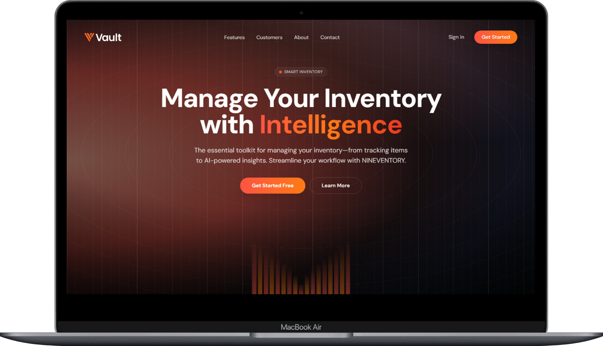

# NINEVENTORY - Smart Inventory Management System

**NINEVENTORY** is a modern, comprehensive inventory management system designed to streamline asset tracking, manage equipment loan requests, and facilitate administrative workflows. It leverages **AI-powered insights** to assist users and employs a **Master-Detail** structure for efficient multi-item loan processing.



## 🚀 Key Features

### 📦 Inventory & Loan Management
-   **Master-Detail Loan System**: Users can request **multiple items** in a single loan transaction (shopping cart style).
-   **Real-time Stock Tracking**: Automatic stock deduction upon approval and restoration upon return.
-   **Approval Workflow**: Admins can review, approve, or reject loan requests with optional feedback.
-   **User History**: Comprehensive log of current and past loans for every user.
-   **Global Shopping Cart**: Persistent cart accessible from the header, allowing users to manage loan items from any page.

### 🤖 AI Chatbot Assistant
-   **Smart Context Awareness**: The chatbot understands the inventory context and user's loan history.
-   **Stock Recommendations**: Automatically suggests **related items** if a requested item is out of stock.
-   **Loan Insights**: Can answer questions like *"What is the most popular item?"* or *"Show my recent activity"*.
-   **Natural Language Processing**: Powered by Cohere/HuggingFace API for human-like interactions.

### 📊 Reporting & Administration
-   **Dashboard Analytics**: Real-time stats on total assets, active loans, and pending requests.
-   **Low Stock Alerts**: Visual indicators on the dashboard when items fall below a safe threshold.
-   **Activity Log**: A full audit trail of all loan transactions (Pending, Approved, Returned, Rejected).
-   **Printable Loan Proof (Surat Jalan)**: Generate professional, print-ready PDF documents for approved loans, complete with signatures and item details.
-   **Export Capability**: Users and Admins can export loan proofs as PDFs.

## 🛠️ Tech Stack

### Frontend
-   **HTML5 & Vanilla PHP**: Lightweight and fast.
-   **[Tailwind CSS](https://tailwindcss.com)**: Utility-first CSS framework for modern, responsive UI.
-   **[Alpine.js](https://alpinejs.dev)**: For reactive components (Cart, Modals, Dropdowns) without build steps.
-   **[Lucide Icons](https://lucide.dev)**: Beautiful, consistent vector icons.

### Backend
-   **PHP 8.2+**: Core server-side logic.
-   **MySQL / MariaDB**: Relational database storage.
-   **PDO**: Secure, object-oriented database interaction.
-   **Composer**: Dependency management.

### AI & APIs
-   **GuzzleHttp**: HTTP client for API requests.
-   **Cohere API / HuggingFace**: Large Language Model (LLM) providers for the chatbot.

## ⚙️ Installation & Setup

1.  **Clone the Repository**
    ```bash
    git clone https://github.com/andi-nugroho/nineventory.git
    cd nineventory
    ```

2.  **Install Dependencies**
    ```bash
    composer install
    ```

3.  **Database Setup**
    -   Create a new MySQL database named `nineventory`.
    -   Import the provided SQL dump (or run migrations if available) to set up tables (`inventory`, `loans`, `loan_details`, `users`).

4.  **Configuration**
    -   Copy `.env.example` to `.env`.
    -   Update database credentials:
        ```env
        DB_HOST=localhost
        DB_NAME=nineventory
        DB_USER=root
        DB_PASS=
        ```
    -   Add your AI API Key:
        ```env
        COHERE_API_KEY=your_api_key_here
        ```

5.  **Run the Application**
    -   Serve via Apache (XAMPP/Laragon) pointing to the `public/` directory.
    -   Or use PHP built-in server:
        ```bash
        cd public
        php -S localhost:8000
        ```

6.  **Access**
    -   Open `http://localhost:8000` in your browser.
    -   Default Admin Creds: (Check database seeder).

## 📄 License
This project is open-source and available under the [MIT License](LICENSE).
